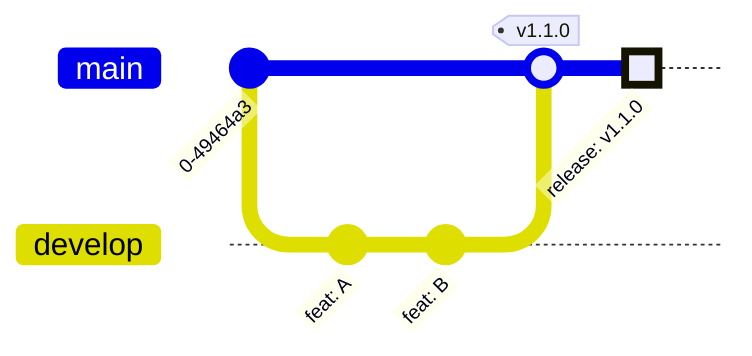
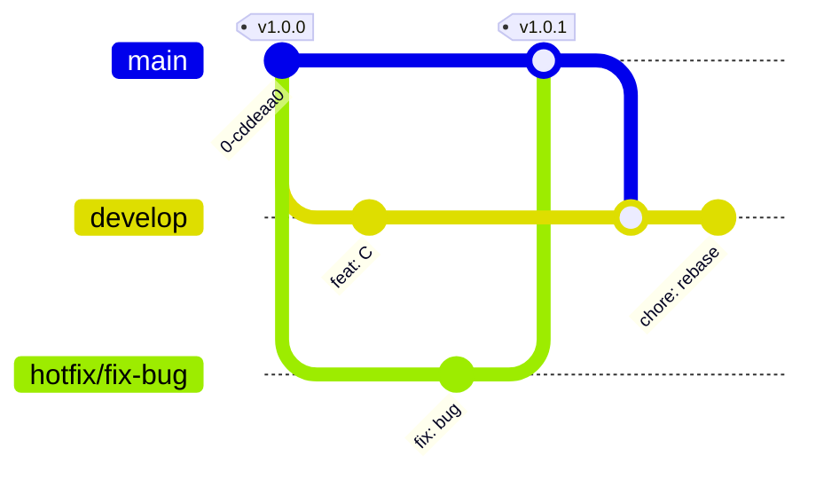

# Release Flow Strategy

## Overview
This document outlines the Git Flow adaptation used for releasing the application.

## Standard Release Flow
Releasing a new feature version (Minor/Major) from `develop`.

**Process:**
1. Features are merged into `develop`.
2. Manual Release Workflow triggered on `develop`.
3. Action fast-forwards `master` to `develop`.
4. Tag created on `master`.
5. Artifacts built and released.

## Hotfix Release Flow
Fixing a bug in production (Patch) directly on `master`.

**Process:**
1. `hotfix/*` branch created from `master`.
2. Fix committed.
3. PR opened to `master`.
4. PR merged (Squash).
5. Manual Release Workflow triggered on `master`.
6. Action tags `master`.
7. Action automatically rebases `develop` onto new `master` commit to keep history linear/synced.
